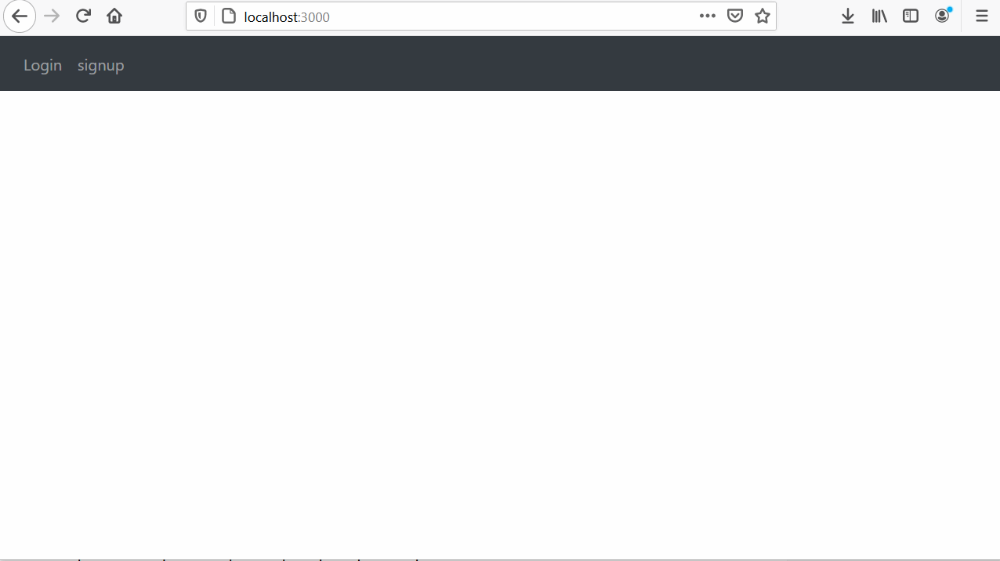

<!-- TABLE OF CONTENTS -->

  
Table of Contents

  <ol>
    <li>
      <a href="#about-the-project">About The Project</a>
      <ul>
        <li><a href="#built-with">Built With</a></li>
      </ul>
    </li>
    <li>
      <a href="#getting-started">Getting Started</a>
      <ul>
        <li><a href="#installation">Running</a></li>
      </ul>
    </li>
  </ol>

<!-- ABOUT THE PROJECT -->
## About The Project

Stock's project to obtain current prices and send e-mail when there is an update.
It is built with django on the backend and reacts on the front end with docker

<!-- GETTING STARTED -->
## Running

1. `docker-compose build`
1. `docker-compose up`
1. There should now be two servers running:
  - [http://127.0.0.1:8000](http://127.0.0.1:8000) is the Django app
  - [http://127.0.0.1:3000](http://127.0.0.1:3000) is the React app

